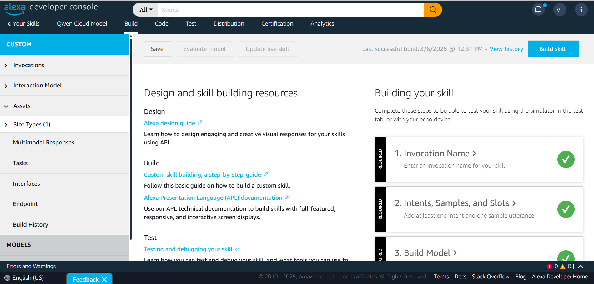
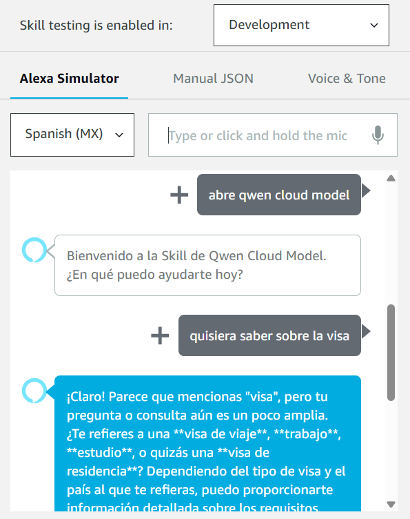

# Alexa-Skill-and-Qwen

## Resumen
Ejemplo de código que integra la API de Qwen de Alibaba Cloud en una Alexa Skill usando Node.js.

## Descripción

Este proyecto demuestra cómo integrar la API de Qwen de Alibaba Cloud en una Alexa Skill utdesde la Alexa Developer Console. La guia del paso a paso la puedes encontrar en el siguiente enlace:

- [Integrando Qwen de Alibaba Cloud en una Alexa Skill](https://vicenteguzman.com/alexa/2025-03-06-alexa-and-qwen/)

## Requisitos

- Cuenta de Alibaba Cloud
- Cuenta de Amazon Developer

## Instalación

1. Clona este repositorio:

    ```bash
    git clone https://github.com/tu-usuario/Alexa-Skill-and-Qwen.git
    ```
2. Navega al directorio del proyecto:
    ```bash
    cd Alexa-Skill-and-Qwen
    ```
3. Instala las dependencias:
    ```bash
    npm install
    ```

## Uso

1. Configura la API Key de Alibaba Cloud en el archivo `index.js`.
2. Despliega la skill en la consola de Amazon Developer.
3. Prueba la skill en tu dispositivo Alexa.

## Capturas de Pantalla

### Pantalla de Inicio


### Ejemplo de Uso


## Contribuciones

Las contribuciones son bienvenidas. Por favor, abre un issue o envía un pull request.

